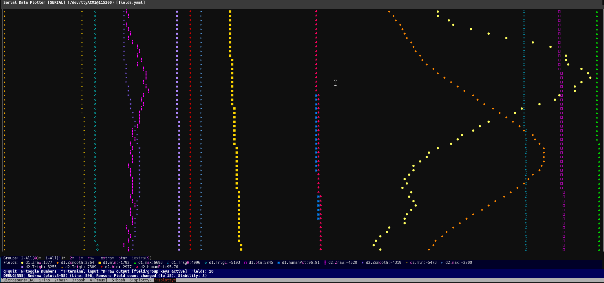
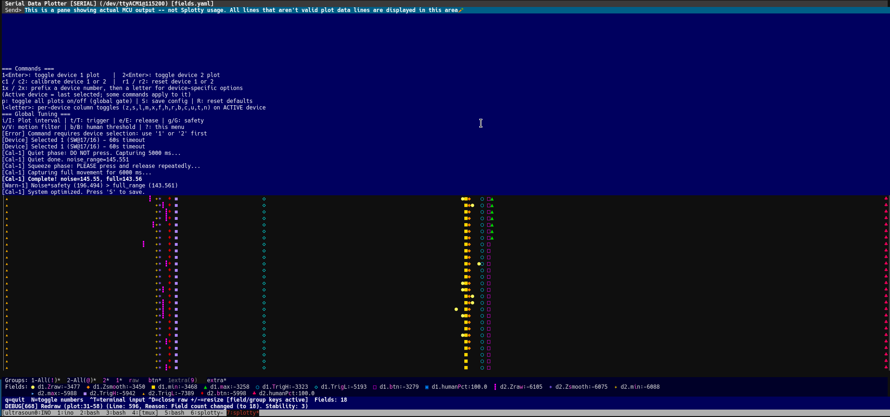

# splotty - Serial Text Plotter

Terminal-based real-time plotter for Arduino and embedded serial data. This seems to be the start of the only proper general-purpose terminal-based plotter, and right now it already works and is usable (at least for many of my projects). It is the first version basically though.

<div align="center">
  <em>Main plotting interface with field legend and controls</em><br>
  <br>
</div>

<div align="center">
  <em>The separated serial-data from non-data output pane frees you to have your MCU output other information, without confusing the plotter (maybe)</em><br>
  <br>
</div>

## Why would I make such a thing?

In short, I got tired of the limitations of every other plotter I used (or could get working). I got tired of spending my time trying to code limitations on fields directly into my firmware. I wanted to just dump out the data and have my plotter give me the power to control it, and to easily group fields together, rapidly toggling whatever I wanted.

Multiple sensors?  30 fields?  Extra data like my raw data vs. my filtered plots?  There might be some plotters out there that can handle this sort of thing, but I've not found them. (I'm not the most experienced, however).  I also wanted to make use of the convenience of not having my hands leave the keyboard. I code in VIM, and am quite at home in the terminal.

GUI?  Well, all alternatives I know of, except hand-coding custom implementations for each project, **are GUI** tools (Better Serial Plotter, SerialPlot, Processing Grapher) that work fine if you want a GUI (and work well with their limitations and inconveniences).  Plus, I wanted the ability to handle the grouping of fields and **mixed data streams** which tend to screw up plotters.

Text UI?  Well... if it appeals to you, you likely already know why.  (It also lets you work over SSH, which I *have* needed on occasion. In any case, it's there when you need it.

## Features

### ✅ Implemented
- Unlimited data fields with keyboard-driven grouping and toggles
- Mixed data streams - plots sensor data, routes other output to separate pane
- State persistence (`~/.config/splotty/state.yaml`) - just run it and continue where you left off
- Field configuration via YAML files with auto-assigned shortcuts
- 256-color and 24-bit color support
- Interactive controls (toggle fields/groups, resize panes, terminal input mode)
- Demo mode for testing without hardware

### 🚧 Work in Progress  
- Sparse labeling (send field labels periodically instead of every line)
- Field stability system (handles noisy/partial serial data)

### 📋 Planned
- Individual field-group normalization/auto-ranging
- Serial port/baud settings stored in state.yaml
- Hotkey macros for sending data to MCU
- Auto-field-template generation (^W to dump current fields to YAML)
- Axis value display for normalized ranges
- Field shifting (left/right for visibility)

### 💭 Potential Improvements
- UDP/network data sources
- Data logging/export
- Multiple plot windows
- Custom data format parsing

## Quick start

```bash
# Demo mode (outputs randomly fluctuating data for instant gratification)
splotty --demo

# Real serial data  
splotty --serial-port=/dev/ttyUSB0 --baud-rate=115200

# With field configuration
splotty -f fields.yaml

# Different serial port (later I'll try to store this in the ~/.config/splotty/state.yaml)
splotty --serial-port=/dev/ttyUSB0
```

Your Arduino just needs to output tab-separated data like:
```
temp:23.4	humidity:67.2	pressure:1013.25
```
or unlabeled values (gets numbered as field1, field2, etc.):
```
23.4	67.2	1013.25
```

## Controls (at present)

While plotting:
- `q` - Quit
- `N` - Toggle inline numbers on plot points  
- `^T` - Toggle terminal input mode (send data to serial)
- `^D` - Toggle non-plot data pane
- `+/-` - Resize non-plot pane (when active)
- `[field keys]` - Toggle individual fields (defined in fieldspec)
- `[group keys]` - Toggle field groups (defined in fieldspec)

## Installation

```bash
# Clone and install dependencies
git clone https://github.com/yourusername/splotty.git
cd splotty

# Install Perl dependencies (example for Ubuntu/Debian)
sudo apt-get install libgetopt-long-descriptive-perl libyaml-xs-perl libfile-homedir-perl
#  or
cpanm Getopt::Long::Descriptive
cpanm YAML::XS
cpanm File::HomeDir

# Make executable and optionally symlink to PATH
chmod +x splotty
cd ~/bin && ln -s $(pwd)/splotty /usr/local/bin/
#  or (yuck)
sudo ln -s $(pwd)/splotty /usr/local/bin/
```

Dependencies:
- Perl 5.36+ 
- YAML::XS
- File::HomeDir
- String::ShortcutsAuto (this is one I wrote to auto-assign shortcut keys -- it's already included in lib/)

## Configuration

### Basic fieldspec (fields.yaml)

```yaml
groups:
  sensors:
    key: "s"
    state: true
  debug:
    key: "d" 
    state: false

fields:
  temperature:
    groups: [sensors]
    fg: 196  # red
  humidity:
    groups: [sensors] 
    fg: 46   # green
  debug_counter:
    groups: [debug]
    hidden: true  # won't display or plot
```

### Advanced configuration

See the included `fields.yaml` for a complete example with:
- RGB colors (`fg24: [255, 0, 255]`)
- Custom glyphs (`ch: "┇"`)
- Auto-assigned shortcuts (`key: "auto"`)
- Group ordering (`order: 1`)
- The variable/functions for this need to be refactored, but they work for now

## Implementation details

### Field stability system
We stabilize field-changes to minimize flickering legend by tracking the appearance of each unique combination of fields. This attempts to pick only valid non-corrupt data - when a line of MCU debug output appears, it won't mess up the recognized fields we're displaying.

### Mixed data handling  
The non-plot data pane (^D) works by examining each line to see if it's valid plot data. If any field is invalid, it gets routed to the separate pane. This also means corrupt field lines (which can happen with lost or partial serial data) end up there, which is useful for debugging.

### State persistence
Your plotting state gets saved to `~/.config/splotty/state.yaml` including:
- Field on/off states
- Group states  
- Last fieldspec file path

Just run `splotty` and it continues where you left off.

### Color support
Supports both 256-color palette and 24-bit RGB. Right now both are available but I haven't separated the functionality - just assume it uses both depending on your field config.
-C might be working to disable color, if you want to be sad (or are sensitive to color)

## Command line options

```
--header=N          Minimum header lines (default: 2)
--footer=N          Minimum footer lines (calculated dynamically)  
--series=N          Initial number of series (default: 4, auto-detected)
--window=N          Autorange window in rows (default: 30)
--delay_ms=N        Inter-row delay in milliseconds (default: 0)
--no-color          Disable color output
--serial-port=PATH  Serial port path (default: /dev/ttyACM1)
--baud-rate=N       Baud rate (default: 115200)
--demo              Use demo mode with fake data
--fieldspec=FILE    Load field specification YAML file
-f FILE             Short form of --fieldspec
--wipe              Wipe stored fieldspec path
--force             Force run, ignoring bad fieldspec path
--help              Show help
--log               Log debug info to log.splotty.txt
--no-enter-ends-input  Don't exit input mode on blank enter
```

## Arduino code example

```cpp
void setup() {
  Serial.begin(115200);
}

void loop() {
  float temp = analogRead(A0) * 0.1; 
  float humidity = analogRead(A1) * 0.2;
  int button = digitalRead(2);
  
  // Labeled format (recommended)
  Serial.print("temp:"); Serial.print(temp);
  Serial.print("\thumidity:"); Serial.print(humidity); 
  Serial.print("\tbtn:"); Serial.println(button);
  
  // Debug output (gets routed to non-plot pane)
  Serial.println("Debug: loop iteration complete");
  
  delay(100);
}
```

## Comparison with alternatives

| Feature | Arduino IDE | GUI Tools | splotty |
|---------|-------------|-----------|---------|
| Field Limit | ~6-8 fields | Varies | Unlimited |
| SSH-Friendly | ❌ | ❌ | ✅ |
| Interactive Toggles | ✅ (IDE 2) | Some | ✅ |
| Mixed Data Streams | ❌ | Limited | ✅ |
| Zero Setup | ✅ | ❌ | ✅ |
| Configuration Files | ❌ | Some | ✅ |
| State Persistence | ❌ | Some | ✅ |

**GUI alternatives worth considering:**
- **Better Serial Plotter**: Good Arduino IDE replacement, drag-and-drop field management
- **SerialPlot**: Stable, supports binary data formats, good for custom protocols  
- **Processing Grapher**: Feature-rich, CSV export, multiple graph types
- **Serial Studio**: Commercial ($179), very polished, lots of widgets

**When to use splotty:**
- You work in terminal/SSH environments
- Need more than 8 fields
- Want to group your fields and quickly toggle the sets' display
- Want mixed sensor data + debug output  
- Like keyboard-driven workflows
- Need state persistence across sessions

## License

MIT License - see LICENSE file.

## Contributing

This is the first version, so there are rough edges. Issues and PRs welcome, especially for:
- Additional data format parsing
- Better field auto-detection
- Documentation improvements

The field stability system could use refinement - right now it's conservative about field changes to avoid legend flicker, but this might be too aggressive in some cases.
